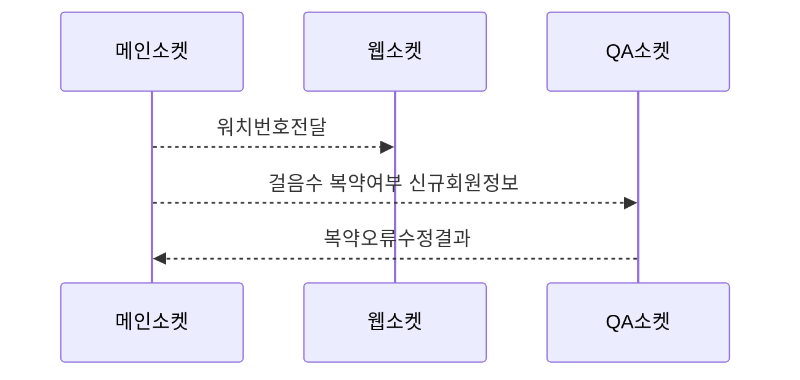

# 소켓정리

- 메인소켓

  - server

    ```
    Socket Language Golang

    ```

  - client
    ```
    Socket Client Java
    ```

- QA소켓

  - server
    ```
    Socket Language Nodejs
    ```
  - client
    ```
    Socket Client Python
    ```

- 웹소켓
  - server
    ```
    Socket Language Nodejs
    ```
  - client
    ```
    Socket Language Html5
    ```

### DB

- Redis
  ```
  메인소켓 워치 온/오프 관리
  ```
- Mongodb
  ```
  QA소켓 정보 관리
  ```


